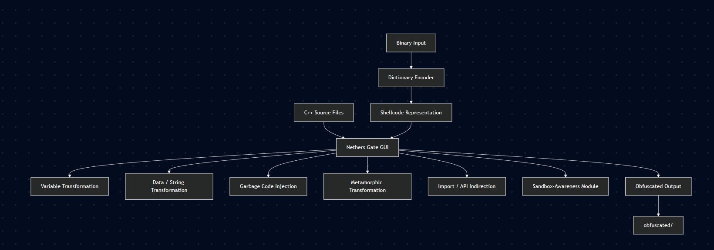

# Nethers Gate

**Nethers Gate** is a Windows-focused C++ source-code obfuscation framework with a Qt-based graphical interface. It was developed as a research/academic project to explore source transformation, code obfuscation, metamorphic techniques, import indirection, string/data transformation, sandbox-awareness, and shellcode representation.

> **Research / Educational Project**
>
> Nethers Gate is intended for authorized security research, malware-analysis education, reverse-engineering research, and controlled laboratory environments. Do not use it to deploy malware, evade security controls on systems you do not own or have explicit authorization to test, or bypass endpoint protections in production environments.

## Overview

Nethers Gate takes C++ source files and applies a configurable pipeline of source-level transformations. The project combines several independent modules behind a Qt GUI so that different transformations can be selected and applied to a source file without manually editing the code.

### Features

- Variable-name transformation
- String/character-data transformation using reversible encoding
- Garbage-code insertion
- Metamorphic function generation and randomized execution order
- Windows API/import indirection
- Sandbox/virtualization environment checks
- Dictionary-based representation of binary shellcode
- HellsGate-oriented shellcode integration
- Qt Widgets desktop interface for selecting files and transformations

The GUI writes transformed source files into an `obfuscated/` directory.

## Architecture



The application is implemented as a Windows desktop application using Qt Widgets. The main entry point initializes `QApplication` and displays `NethersGateGUI`.

## Features

### 1. Variable Name Transformation

The variable extraction module identifies common C/C++ declarations using regular expressions and builds a mapping of original identifiers to generated identifiers.

The implementation handles several declaration categories, including:

- Standard variables
- Pointer declarations
- Simple arrays

String and character data can additionally be passed through the project's reversible transformation routine.

Relevant files:

- `variableExtraction.h`
- `Variable_obfuscation.h`
- `randomString.h`

The extraction and replacement logic is implemented through regex-based source analysis rather than a full C++ parser.

### 2. String and Character Data Transformation

The project contains a reversible string/data transformation mechanism used when processing supported `string`, `char`, and `unsigned char` values.

The transformation is inserted into the generated source so that the original value can be reconstructed at runtime.

This functionality is integrated into the variable-extraction pipeline rather than being a standalone compiler pass.

### 3. Garbage Code Injection

`garbageCodeInsert.h` contains multiple templates for generating semantically unrelated functions.

Examples of generated workloads include:

- String manipulation
- Prime-number calculations
- Array sorting
- Matrix multiplication
- Pseudo-random path calculations

The generator selects templates and creates uniquely named functions before inserting them into the source.

The GUI currently invokes the module with a fixed number of generated functions.

### 4. Metamorphic Transformation

The metamorphism module provides a source transformation in which marked functions can be collected and executed through a generated function-pointer mechanism.

The generated support code:

1. Creates a collection of function pointers.
2. Randomizes their order using `std::shuffle`.
3. Executes the functions according to the resulting order.

This demonstrates how program structure and execution ordering can be changed while retaining the overall source-level behavior of selected routines.

Relevant file:

```text
metamorphism.h
```

### 5. Windows API / Import Indirection

The import-obfuscation module identifies Windows API functions by examining exported functions from selected system DLLs.

The current implementation works with APIs exported by:

- `kernel32.dll`
- `user32.dll`
- `ntdll.dll`
- `advapi32.dll`

Recognized API calls can be rewritten to use a generated API-resolution mechanism. The generated resolver locates the module exporting the requested API and resolves the function at runtime.

Relevant file:

```text
ImportObfuscation.h
```

### 6. Sandbox-Awareness Checks

`sandboxEvasion.h` contains a collection of Windows environment checks designed to identify indicators commonly associated with virtualized or analysis environments.

The implementation includes checks involving areas such as:

- Running process names
- Virtualization-related files
- Registry indicators
- Virtual-machine drivers and services
- Hypervisor information
- System characteristics

For example, the repository contains checks for virtualization-related process names, VM files, registry artifacts, and VM driver/service indicators.

The project exposes these checks through the GUI as a selectable transformation module.

> These checks are included for security research and analysis of environment-detection techniques and should only be evaluated in isolated, authorized environments.

### 7. Dictionary-Based Binary Representation

`DictionShellcode.py` converts raw binary input into a dictionary-based representation.

The script:

1. Loads a word list from `english-words.txt`.
2. Selects 256 unique words.
3. Maps byte values to dictionary words.
4. Converts the input bytes into the corresponding word sequence.
5. Generates C++ or C#-style dictionary declarations.
6. Optionally writes the generated representation to a file.

The C++ application invokes this script when the corresponding binary module is selected.

This demonstrates an alternative representation of binary data rather than storing the original byte sequence directly.

### 8. HellsGate Integration

The repository contains a dedicated `hellsgatesourcefiles/` directory containing:

- `hellsgatemain.c`
- `hellsgate.asm`
- `structs.h`

The GUI can generate an output directory containing the HellsGate-oriented source components and integrate the generated binary-data representation into the source template.

The **HellsHall** option is present in the GUI architecture but is currently only partially implemented.

## GUI Workflow

The graphical interface is designed around the following workflow:

```text
Select C++ source files
          │
          ▼
Select transformation modules
          │
          ├── Variable names
          ├── Variable/string data
          ├── Garbage code
          ├── Metamorphism
          ├── Import indirection
          └── Sandbox-awareness
          │
          ▼
Optional binary input
          │
          ▼
Apply transformations
          │
          ▼
obfuscated/
```

The GUI enforces mutual exclusivity between the available shellcode-oriented options and enables `.bin` selection when one of those options is selected.

## Project Structure

```text
Nethers-gate/
│
├── NethersGateGUI.cpp
├── NethersGateGUI.h
├── NethersGateGUI.ui
├── NethersGateGUI.qrc
├── NethersGateGUI.sln
├── NethersGateGUI.vcxproj
├── NethersGateGUI.vcxproj.filters
│
├── main.cpp
│
├── ApplySandboxEvasion.h
├── ImportObfuscation.h
├── Variable_obfuscation.h
├── variableExtraction.h
├── metamorphism.h
├── garbageCodeInsert.h
├── garbageDataInsert.h
├── randomString.h
├── shellcodeEncoder.h
├── sandboxEvasion.h
├── liberaries.h
│
├── DictionShellcode.py
├── english-words.txt
├── payload.bin
│
├── example.cpp
│
├── hellsgatemain.c
├── walkthroughhellsgate.h
│
└── hellsgatesourcefiles/
    ├── hellsgate.asm
    ├── hellsgatemain.c
    └── structs.h
```

The Visual Studio project explicitly includes the major transformation headers and the Qt UI/resource files.

## Requirements

The project is currently configured as a Windows x64 Visual Studio project.

### Build Environment

The checked-in Visual Studio project specifies:

- Windows x64
- Visual Studio toolset `v143`
- Qt `6.8.2`
- Qt modules:
  - `core`
  - `gui`
  - `widgets`
- C++17 functionality
- Python 3.x for the dictionary-based binary module

The project file contains both `Debug|x64` and `Release|x64` configurations.

### Python Dependency

`DictionShellcode.py` imports:

```text
pyperclip
```

Install it with:

```bash
pip install pyperclip
```

## Building

1. Install Visual Studio with the **Desktop development with C++** workload.
2. Install Qt 6.8.2 for MSVC 2022 64-bit.
3. Ensure the Qt Visual Studio integration is available.
4. Open:

```text
NethersGateGUI.sln
```

5. Select an x64 configuration.
6. Build the solution.
7. Run the resulting application.

The project is configured to use Qt's `core`, `gui`, and `widgets` modules.

## Using the GUI

At a high level:

1. Launch Nethers Gate.
2. Select one or more C++ source files.
3. Select the transformations to apply.
4. If a binary-oriented module is selected, provide the required `.bin` input.
5. Apply the selected transformations.
6. Review the generated files under:

```text
obfuscated/
```

The application preserves the original source and writes transformed copies rather than overwriting the selected input files.

## Output

Depending on the selected modules, the application may generate:

```text
obfuscated/
├── <transformed-source>.cpp
└── hellsgatefiles/
    ├── main.c
    ├── hellsgate.asm
    └── structs.h
```

The exact output depends on the selected transformation modules.

## Design Notes

Nethers Gate is primarily a **source transformation framework**, rather than a traditional compiler or packer.

The transformation pipeline operates directly on source text using techniques such as:

- Regular-expression parsing
- String replacement
- Generated source insertion
- Function-name extraction
- Generated helper functions
- Runtime API resolution
- External Python-assisted data conversion

This makes the project useful for studying the relationship between source representation, compilation, runtime behavior, and static-analysis visibility.

## Limitations

The current implementation is a research prototype and has several limitations:

- Source parsing is primarily regex-based rather than using a full C/C++ parser.
- Complex C++ syntax may not be handled correctly.
- Some transformations depend on specific source-code markers.
- The transformation pipeline is order-dependent.
- The sandbox-awareness module contains environment-specific heuristics.
- The HellsHall option is not fully implemented.
- The Python dictionary encoder requires the accompanying word list.
- The project is currently Windows-oriented.
- Generated source should be reviewed and compiled independently before use in any research environment.

## Research Areas Demonstrated

This project brings together several areas of systems and security research:

- Source-code transformation
- Program obfuscation
- Metamorphic techniques
- Static-analysis resistance
- Runtime API resolution
- Windows internals
- Virtualization/sandbox identification
- Binary data encoding
- Shellcode representation
- C++ source generation
- Qt desktop application development

## Security and Ethical Use

Nethers Gate contains functionality that can be relevant to malware research, reverse engineering, and analysis-evasion studies.

Use this project only when you have explicit authorization.

Recommended environments include:

- Isolated virtual machines
- Malware-analysis laboratories
- University security labs
- Authorized red-team research environments
- Defensive research and reverse-engineering exercises

Do **not** use the project to:

- Deploy malware against third parties
- Evade endpoint protection on unauthorized systems
- Hide unauthorized software
- Bypass security controls on systems you do not own
- Deliver unauthorized payloads

If experimenting with generated binaries, keep the environment isolated and avoid connecting the test environment to production networks.

## Disclaimer

This repository is provided for educational and security-research purposes. The author does not encourage or endorse unauthorized access, malware deployment, evasion of security controls, or other malicious use of the software.

The user is solely responsible for complying with applicable laws, organizational policies, and authorization requirements when using this project.

## Author

**MONO-C1oud**

GitHub: https://github.com/MONO-C1oud
